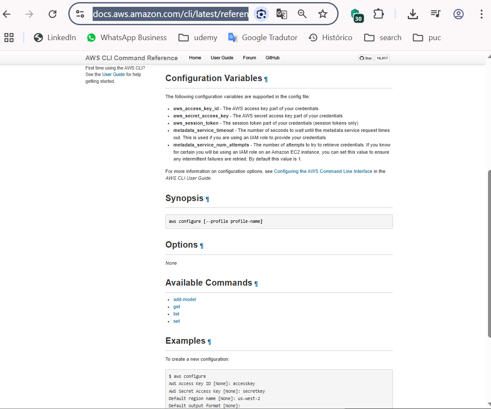

## Script Automation for S3 AWS 💡 ☁  

Functions and scripts developed based on official AWS recommendations to reduce waste, complying with FinOps best practices, in relation to files that are no longer used.


- https://docs.aws.amazon.com/cli/latest/reference/s3api/delete-bucket.html
- https://docs.aws.amazon.com/cli/latest/reference/s3api/delete-object.html
- https://boto3.amazonaws.com/v1/documentation/api/latest/index.html

Additional documentation for S3 management best practices:
- https://docs.aws.amazon.com//AmazonS3/latest/userguide/storage-class-intro.html
- https://docs.aws.amazon.com/AmazonS3/latest/userguide/analytics-storage-class.html
- https://docs.aws.amazon.com/AmazonS3/latest/userguide/object-lifecycle-mgmt.html
- https://calculator.aws/#/

 **Example:**
 ````
#list buckets 
aws s3 ls

#delete objects
aws s3 rm --recursive s3://namebucket

#remove bucket
aws s3 rb --force s3://namebucket
````
## Download AWS ClI ⬇️
**Choose Linux, Mac or Windows:**
  - Download: https://docs.aws.amazon.com/pt_br/cli/latest/userguide/getting-started-install.html

## Generate Create access key 🔑
  - https://docs.aws.amazon.com/keyspaces/latest/devguide/create.keypair.html
    
## Install AWS Cli 💻
  - **type:** 
```aws configure``` in cmd or gitbash

##  AWS config

 

````
$ aws configure
AWS Access Key ID [None]: EXMAPLE
AWS Secret Access Key [None]:  EXAMPLE
Default region name [None]: us-west-2
Default output format [None]: json
````

https://docs.aws.amazon.com/cli/latest/reference/configure/

````js
const AWS = require('aws-sdk');
const fs = require('fs');

const s3 = new AWS.S3();
const session = new AWS.Session();
const trn = "list.txt";

fs.readFile(trn, 'utf8', (err, data) => {
    if (err) throw err;
    const lines = data.split('\n');
    lines.forEach(line => {
        const bucketName = line.trim();
        const bucket = s3.bucket(bucketName);
        console.log(bucket);
        prompt('digite algo para continuar');
        s3.listObjectVersions({ Bucket: bucketName }, (err, data) => {
            if (err) throw err;
            const versions = data.Versions;
            versions.forEach(version => {
                s3.deleteObject({ Bucket: bucketName, Key: version.Key, VersionId: version.VersionId }, (err) => {
                    if (err) throw err;
                });
            });
            s3.deleteBucket({ Bucket: bucketName }, (err) => {
                if (err) throw err;
            });
        });
    });
});
````
````bash
!/bin/bash

# Check if AWS CLI is installed
if ! command -v aws &> /dev/null; then
    echo "AWS CLI is not installed. Please install it before running this script."
    exit 1
fi

# Check if list.txt exists
if [ ! -f "list.txt" ]; then
    echo "list.txt not found. Please create it before running this script."
    exit 1
fi

# Read bucket names from list.txt
while IFS= read -r line; do
    bucket_name=$(echo "$line" | tr -d '[:space:]')
    if [ -n "$bucket_name" ]; then
        # Check if bucket exists
        if aws s3 ls "s3://$bucket_name" &> /dev/null; then
            # Delete all object versions in the bucket
            aws s3api delete-objects --bucket "$bucket_name" --delete "$(aws s3api list-object-versions --bucket "$bucket_name" --query '{Objects: Versions[].{Key:Key,VersionId:VersionId}}' --output json)"
            aws s3api delete-objects --bucket "$bucket_name" --delete "$(aws s3api list-object-versions --bucket "$bucket_name" --query '{Objects: DeleteMarkers[].{Key:Key,VersionId:VersionId}}' --output json)"
            
            # Delete the bucket
            aws s3 rb "s3://$bucket_name" --force
            echo "Bucket $bucket_name deleted"
        else
            echo "Bucket $bucket_name does not exist"
        fi
    fi
    
    # 
    read -p ""
```` 

>[!NOTE]
> Repository for personal and professional study purposes
> This material is study personal and does not replace official documentation, always follow the official documentation.
